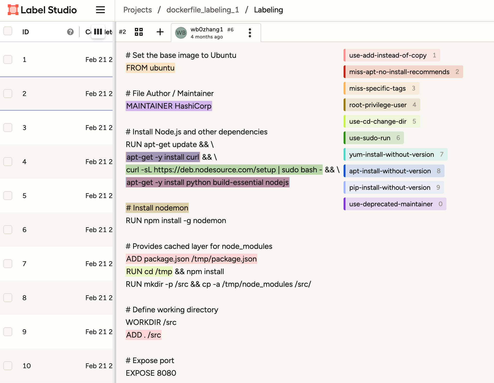

# # Fine-Tuning Qwen LLM for Dockerfiles security risk analysis

## Introduction

This project records the process of my Fine-tuning on Qwen3-8B to implement the classification task of common security risks in dockerfile

## Architecture

## Training Techniques

| Technique | Implementation | Explanation |
|-----------|----------------|-------------|
| **Model loading** | *BitsAndBytes* 4-bit **NF4** quantization `load_in_4bit=True`, `bnb_4bit_quant_type="nf4"` + `torch_dtype=torch.bfloat16` | NF4 + BF16 keeps almost-fp32 range while cutting memory in half; faster and numerically stable. |
| **Parameter-efficient fine-tuning** | **LoRA** (Low-Rank Adaptation) + `enable_input_require_grads()` | * LoRA trains only a tiny subset of weights. * `enable_input_require_grads` prevents missing‐gradient errors on LoRA inputs. |
| **Further memory reduction** | `gradient_checkpointing_enable()` | Saves activations to disk and recomputes on-the-fly; lowers peak VRAM. |
| **Data processing** | Custom `DataCollatorForCausalLMWithAssistantMask` that keeps labels **only** on *assistant* turns | Marks user / system tokens as `-100`, so loss is computed solely on assistant text—improves response quality. |
| **ChatML templating** | `tokenizer.apply_chat_template(..., enable_thinking=False)` | Converts raw messages straight to Qwen-3 ChatML; no hand-written prompt glue needed. |
| **Training control** | `EarlyStoppingCallback` + `load_best_model_at_end=True` | * Stops when loss plateaus—saves compute. * Automatically reloads the best checkpoint—no manual search. |
| **Resume training** | `resume_from_checkpoint=True` & optional **LoRA adapter** warm-start | Can pick up after crashes *or* reuse a previous LoRA as warm-start for a new run. |
| **Observability** | `report_to="wandb"` + `wandb.finish()` | Logs metrics, hyper-params, system stats to Weights & Biases for easy tracking & sharing. |
| **Configurable cache / weight paths** | Redirect caches via environment variables | Typical on cloud clusters: move HF/transformers/datasets/W&B caches to a larger data disk and save checkpoints there. |

## Server Specification

| Component | Specification |
|-----------|---------------|
| **Image** | PyTorch 2.1.0 · Python 3.10 (Ubuntu 22.04) · CUDA 12.1 |
| **GPU**   | 1 × NVIDIA L20 (48 GB) |
| **CPU**   | 20 vCPU Intel® Xeon® Platinum 8457C |
| **Memory**| 100 GB RAM |
| **Storage** | System Disk  30 GB Data Disk  80 GB |

## Technical Overview

### Determining Risk Types

By extracting and mapping rules from the most-used open-source static-analysis tools on the market—**Trivy, Hadolint, KICS, Terrascan**—I obtained the overall risk taxonomy.

After evaluating **40 000** samples, I selected the **top 10 risk categories** as the targets for this training task.

### Training-Data Labelling

I manually labelled **4 000** samples with the open-source platform [Label Studio](https://labelstud.io/), obtaining the *ground-truth* dataset.

### Training-Data Processing

The data were balanced via oversampling to reduce the impact of low-frequency classes, then reformatted into **ChatML** compatible with Qwen-3.

### Training Process

  
  

### Result Comparison

I compared several static tools with the LLM on the validation set:

- **Accuracy** – the LLM is on par with static tools (actual difference < 1 %).  
- **Recall** – the LLM shows a clear advantage.

This matches my expectations: LLMs excel at contextual understanding and can detect security risks that traditional regex-based scanners miss.

## Future Work

Based on the above analysis, I think we can optimize from the following two aspects:

- **Raise accuracy** by improving data quality and scaling up the model.  
- **Architecture comparison** – evaluate Transformer-based Encoder-only or Encoder-Decoder (seq2seq) models against the current Decoder-only Qwen-3.

I believe AI will continue to surprise us with its capabilities in security scanning.